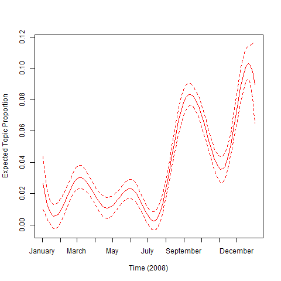
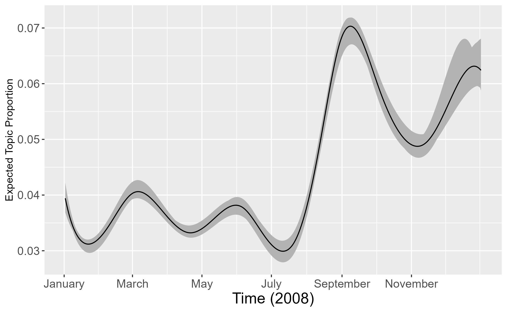
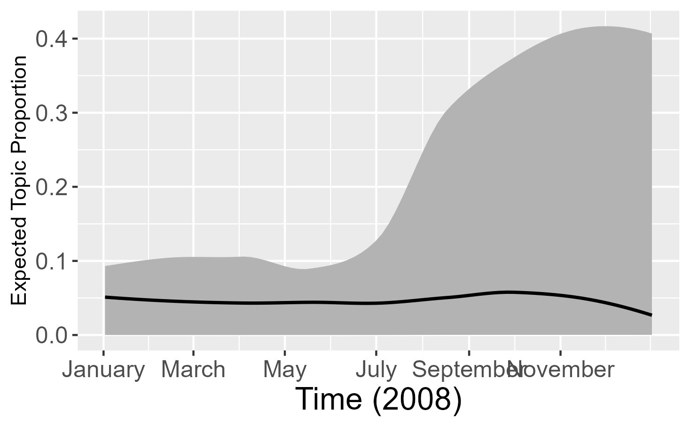
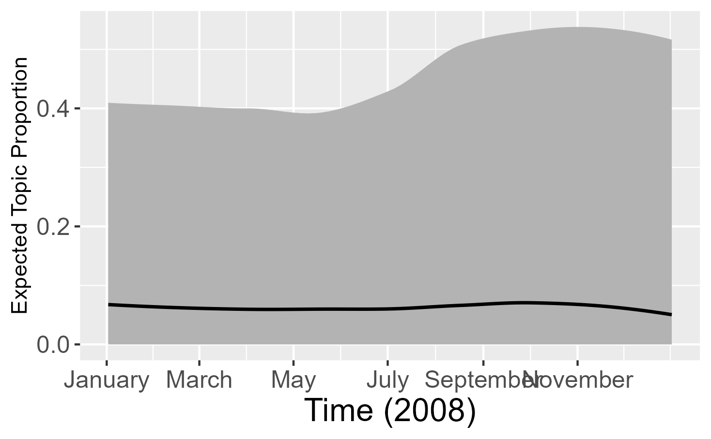

<!-- README.md is generated from README.Rmd. Please edit that file -->

# Analyzing topic-metadata relationships with stmprevalence

This package provides additional functionalities to examine the link
between prevalence covariates and topic proportions:

-   Implementation of the method of composition based on either a Beta
    regression or a quasibinomial GLM. The method of composition is
    implemented in the [stm](http://www.structuraltopicmodel.com/)
    package through the function `stm::estimateEffect()`, which employs
    a simple OLS regression. This violates the assumption of (sampled)
    topic proportions being restricted to `(0,1)`, which is the
    motivation for our extension.
-   Direct assessment of the prevalence output produced by the , i.e.,
    the MAP estimates for `Gamma` and `Sigma`, by sampling from a
    logistic normal distribution.
-   Fully Bayesian version of the method of composition via a Bayesian
    Beta regression (instead of frequentist regression).

The approaches can be used to visualize the empirical mean as well as
credible intervals of topic proportions for the full observed range of a
specified variable, while holding all other variables as mean/majority
vote.

### Installation

You can install `stmprevalence` from github with:

``` r
# install.packages("devtools")
devtools::install_github("PMSchulze/stmprevalence")
```

### Examples

#### Setup

``` r
# devtools::install_github("PMSchulze/stmprevalence") # install from github
library(stmprevalence)
library(stm)
library(ggplot2)
# set locale to English
Sys.setlocale("LC_TIME", "English")
```

We use a workspace with models already estimated, the same that is used
in the stm vignette; see
<https://cran.r-project.org/web/packages/stm/vignettes/stmVignette.pdf>

``` r
# load(url("http://goo.gl/VPdxlS"))
load("VignetteObjects.RData") # downloaded from http://goo.gl/VPdxlS
```

#### Method of composition with OLS via stm::estimateEffect()

Let’s consider Figure 7 (p.20) from the vignette, which is generated
based on the `stm::estimateEffect()` function. We first specify the
prevalence formula and the topic. In this case we choose to perform the
method of composition for topics 1 through 7 (out of 20).

``` r
prevalence <- 1:7 ~ rating + s(day)
topic <- 7
```

We see that the confidence bands take on negative values at two points
(end of January and mid of July):

``` r
out$meta$rating <- as.factor(out$meta$rating)
prep <- estimateEffect(prevalence, poliblogPrevFit, meta = out$meta, uncertainty = "Global")

plot(prep, "day", method = "continuous", topics = topic, model = z, 
     printlegend = FALSE, xaxt = "n", xlab = "Time (2008)")
monthseq <- seq(from = as.Date("2008-01-01"), to = as.Date("2008-12-01"), by = "month")
monthseq_num <- as.numeric(monthseq) - min(as.numeric(monthseq))
monthnames <- months(monthseq)
axis(1, at = monthseq_num, labels = monthnames)
```



#### Method of composition with frequentist Beta regression

We use the same prevalence formula as for the model fit with
`stm::estimateEffect()`. The number of iterations of the method of
composition is set to `nsims = 5` in this demo (for shorter runtime); in
practice this should be much higher.

``` r
nsims <- 5
```

We see that the confidence bands do not take on negative values anymore:

``` r
# estimate nsims quasibinomial glms and sample from regressions coefficients
all_beta <- stmprevalence::sample_coefs(poliblogPrevFit, prevalence, type = "beta",
                          out$meta, nsims = nsims, seed = 2020)

# predict mean and uncertainty (with respect to mean prediction)
## for variable "day"
preds_day <- stmprevalence::predict_props(all_beta, "day", prevalence, out$meta)

## for variable "rating"
preds_rating <- stmprevalence::predict_props(all_beta, "rating", prevalence, out$meta)

# plot relationship over time
ggplot(preds_day[[paste0("Topic", topic)]], aes(day)) + 
         geom_ribbon(aes(ymin = ci_lower, ymax = ci_upper), fill = "grey70") +
         xlab("Time (2008)") +
         ylab("Expected Topic Proportion") +
         geom_line(aes(y = proportion)) +
         scale_x_continuous(breaks = monthseq_num[seq(1, length(monthseq_num), 2)], 
                            labels = monthnames[seq(1, length(monthnames), 2)]) +
         theme(axis.text=element_text(size=12), 
               axis.title.x = element_text(size=16))
```



#### Direct assessment of the prevalence output via sampling from logistic normal distribution

In order to examine the relation of prevalence covariates and topic
proportions considering the joint dependence among latter ones, we can
directly use the output produced by the STM: inference within the STM
involves finding the maximum-a-posteriori (MAP) estimate
$\hat{\boldsymbol{\Gamma}}$ and the maximum likelihood estimate
$\hat{\boldsymbol{\Sigma}}$. We can then plug these estimates into the
logistic normal distribution and visualize sampled values from this
distribution.

In this approach, the estimated uncertainty is no longer with respect to
the prediction of the of topic proportions, but instead with respect to
the topic proportions in the data - and thus, much higher than
previously.

``` r
preds_logisticn <- stmprevalence::sample_props_logisticn(poliblogPrevFit, "day", prevalence, out$meta)

# Note that uncertainty is no longer with respect to mean prediction, but instead shows variation in the data 
plot_smoothed_ci <- ggplot(preds_logisticn[[paste0("Topic", topic)]]) +
  stat_smooth(color=NA, aes(x = day, y = ci_lower), method = "loess", se = FALSE) +
  stat_smooth(color=NA, aes(x = day, y = ci_upper), method = "loess", se = FALSE)
smoothed_ci <- ggplot_build(plot_smoothed_ci)
df_smoothed_ci <- data.frame(day = smoothed_ci$data[[1]]$x,
                             ci_lower = smoothed_ci$data[[1]]$y,
                             ci_upper = smoothed_ci$data[[2]]$y)
plot_smoothed_ci + 
  geom_ribbon(data = df_smoothed_ci, aes(x = day, ymin = ci_lower, ymax = ci_upper), 
              fill = "grey70") +
  geom_smooth(data = preds_logisticn$Topic1, aes(x = day, y = proportion),
              color = "black", method = "loess", se = FALSE, size = 0.8) +
  xlab("Time (2008)") + 
  ylab("Expected Topic Proportion") +
  scale_x_continuous(breaks = monthseq_num[seq(1, length(monthseq_num), 2)], 
                     labels = monthnames[seq(1, length(monthnames), 2)]) +
  theme(axis.text=element_text(size=12), 
        axis.title.x = element_text(size=16))
```



However, compared to the fully Bayesian approach (see below) the direct
assessment approach exhibits much lower variation. This is due to the
fact that plugging in $\hat{\boldsymbol{\Gamma}}$ and
$\hat{\boldsymbol{\Sigma}}$ is a “na{"i}ve” approach. To further refine
this direct assessment approach, we would need to first sample
prevalence parameters from their posterior and subsequently plug these
samples into the logistic normal distribution, yielding samples from the
posterior predictive distribution of topic proportions. This would
likely result in a variation on the scale of the results obtained using
the fully Bayesian regression approach. Unfortunately, sampling of
prevalence parameters is not possible using the R package .

#### Method of composition with fully Bayesian Beta regression

We can also replace the (frequentist) regression in the second step of
each iteration of the method of composition with an entirely Bayesian
framework - a Bayesian Beta regression with normal priors centered
around zero. To do so, we sample proportions from the respective
posterior predictive distribution at the end of each step of the method
of composition (i.e., conditioning on previously sampled
$\boldsymbol{\theta}_{(k)}^*$) at different covariate values
$\boldsymbol{x}_{\text{pred}}$. This allows us to display the
(predicted) variation of topic proportions at different covariate
levels. Furthermore, the calculation of empirical quantities of
interest, such as the mean, now occurs within a fully Bayesian
framework, allowing for sound interpretations.

``` r
# here we have to first factorize all categorical metadata variables
metadata <- out$meta
metadata[sapply(metadata, is.character)] <- lapply(metadata[sapply(metadata, is.character)], 
                                                   as.factor)

# Obtain MAP estimates of nsims Bayesian beta regressions
mod_betaregs <- stmprevalence::beta_bayes(poliblogPrevFit, prevalence, metadata, nsims = 5)
 
# Draw from posterior predictive distribution of previously obtained Beta regressions
preds_betas_bayes <- stmprevalence::posterior_predict_props(mod_betaregs, "day", prevalence, metadata, 
                                                          ci_lower = 0.025, ci_upper = 0.975)

# Again, uncertainty is not with respect to mean prediction. Instead, we observe predicted variation in the data at a given level of the covariate.
plot_smoothed_ci <- ggplot(preds_betas_bayes[[paste0("Topic", topic)]]) +
  stat_smooth(color=NA, aes(x = day, y = ci_lower), method = "loess", se = FALSE) +
  stat_smooth(color=NA, aes(x = day, y = ci_upper), method = "loess", se = FALSE)
smoothed_ci <- ggplot_build(plot_smoothed_ci)
df_smoothed_ci <- data.frame(day = smoothed_ci$data[[1]]$x,
                             ci_lower = smoothed_ci$data[[1]]$y,
                             ci_upper = smoothed_ci$data[[2]]$y)
plot_smoothed_ci + 
  geom_ribbon(data = df_smoothed_ci, aes(x = day, ymin = ci_lower, ymax = ci_upper), 
              fill = "grey70") +
  geom_smooth(data = preds_betas_bayes$Topic1, aes(x = day, y = proportion),
              color = "black", method = "loess", se = FALSE, size = 0.8) +
  ylab("Expected Topic Proportion") +
  xlab("Time (2008)") + 
  scale_x_continuous(breaks = monthseq_num[seq(1, length(monthseq_num), 2)], 
                     labels = monthnames[seq(1, length(monthnames), 2)]) +
  theme(axis.text=element_text(size=12), 
        axis.title.x = element_text(size=16))
```


