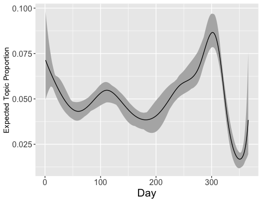

<!-- README.md is generated from README.Rmd. Please edit that file -->

## stmprevalence: inspect prevalence covariates

This package provides additional functionalities to examine the link
between prevalence covariates and topic proportions. Namely, these are:

  - Implementation of what is known as the "method of composition" in the social sciences (see Tanner, 2012, p. 52, http://doi.org/10.1007/978-1-4612-4024-2), using either a quasibinomial GLM or a beta regression. The method of composition is implemented in the [stm package](http://www.structuraltopicmodel.com/) (Roberts et. al, 2016, https://doi.org/10.18637/jss.v091.i02) through its function `stm::estimateEffect()`, employing a simple OLS regression. This violates the assumption of (sampled) topic proportions being restricted to `(0,1)`, which is the motivation for our extension.
  - Direct assessment of the prevalence output produced by the stm, i.e., the MAP estimates for `Gamma` and `Sigma`, by sampling from a logistic normal distribution.
  - Fully Bayesian version of the method of composition via a Bayesian beta regression (instead of frequentist regression).

The approaches can be used to visualize the empirical mean as well as
credible intervals of topic proportions for the full observed range of a
specified variable, while holding all other variables as mean/majority
vote.

### Installation

You can install `stmprevalence` from github with:

``` r
# install.packages("devtools")
devtools::install_github("PMSchulze/stmprevalence")
```

### Examples

``` r
# devtools::install_github("PMSchulze/stmprevalence") # install from github
library(stmprevalence)
library(stm)
library(ggplot2)
```

We use a workspace with models already estimated, the same that is used
in the stm vignette; see
<https://cran.r-project.org/web/packages/stm/vignettes/stmVignette.pdf>

``` r
load(url("http://goo.gl/VPdxlS"))
```

The prevalence formula can be specified in a similar manner as in
`stm::estimateEffect()`. In this case we choose to perform the method of
composition for topic 1 and topic 2 (out of 20 topics).

``` r
prevalence <- 1:2~rating + s(day)
```

The number of iterations of the method of composition is set to `nsims
= 5` in this demo (for shorter runtime); in practice this should be much
higher.

``` r
nsims <- 5
```

#### Method of composition with a quasibinomial glm:

``` r
# estimate nsims quasibinomial glms and sample from regressions coefficients
all_quasibin <- stmprevalence::sample_coefs(poliblogPrevFit, prevalence, type = "quasibinomial",
                          out$meta, nsims = nsims, seed = 2020)

# predict mean and uncertainty (with respect to mean prediction)
## for variable "day"
preds_day <- stmprevalence::predict_props(all_quasibin, "day", prevalence, out$meta)

## for variable "rating"
preds_rating <- stmprevalence::predict_props(all_quasibin, "rating", prevalence, out$meta)

# plot relationship over time
ggplot(preds_day$Topic1, aes(day)) + 
         geom_ribbon(aes(ymin = ci_lower, ymax = ci_upper), fill = "grey70") +
         xlab("Day") +
         ylab("Expected Topic Proportion") +
         geom_line(aes(y = proportion)) +
         scale_x_continuous(labels = scales::comma) +
         theme(axis.text=element_text(size=12), 
               axis.title.x = element_text(size=16))
```



#### Direct assessment of the prevalence output via sampling from logistic normal distribution.

``` r
preds_logisticn <- stmprevalence::sample_props_logisticn(poliblogPrevFit, "day", prevalence, out$meta)

# Note that uncertainty is now not with respect to mean prediction, but instead just the shows variation in the data 
plot_smoothed_ci <- ggplot(preds_logisticn$Topic1) +
  stat_smooth(color=NA, aes(x = day, y = ci_lower), method = "loess", se = FALSE) +
  stat_smooth(color=NA, aes(x = day, y = ci_upper), method = "loess", se = FALSE)
smoothed_ci <- ggplot_build(plot_smoothed_ci)
df_smoothed_ci <- data.frame(day = smoothed_ci$data[[1]]$x,
                             ci_lower = smoothed_ci$data[[1]]$y,
                             ci_upper = smoothed_ci$data[[2]]$y)
plot_smoothed_ci + 
  geom_ribbon(data = df_smoothed_ci, aes(x = day, ymin = ci_lower, ymax = ci_upper), 
              fill = "grey70") +
  geom_smooth(data = preds_logisticn$Topic1, aes(x = day, y = proportion),
              color = "black", method = "loess", se = FALSE, size = 0.8) +
  ylab("Expected Topic Proportion") +
  xlab("Day") + 
  scale_x_continuous(labels = scales::comma) +
  theme(axis.text=element_text(size=12), 
        axis.title.x = element_text(size=16))
```

#### Fully Bayesian version of method of composition (with Bayesian beta regression)

``` r
# here we have to first factorize all categorical metadata variables
metadata <- out$meta
metadata[sapply(metadata, is.character)] <- lapply(metadata[sapply(metadata, is.character)], 
                                                   as.factor)

# Obtain MAP estimates of nsims Bayesian beta regressions
mod_betaregs <- stmprevalence::beta_bayes(poliblogPrevFit, prevalence, metadata, nsims = 5)
 
# Draw from posterior predictive distribution of previously obtained Beta regressions
preds_betas_bayes <- stmprevalence::posterior_predict_props(mod_betaregs, "day", prevalence, metadata, 
                                                          ci_lower = 0.025, ci_upper = 0.975)

# Again, uncertainty is not with respect to mean prediction. Instead, we observe predicted variation in the data at a given level of the covariate.
plot_smoothed_ci <- ggplot(preds_betas_bayes$Topic1) +
  stat_smooth(color=NA, aes(x = day, y = ci_lower), method = "loess", se = FALSE) +
  stat_smooth(color=NA, aes(x = day, y = ci_upper), method = "loess", se = FALSE)
smoothed_ci <- ggplot_build(plot_smoothed_ci)
df_smoothed_ci <- data.frame(day = smoothed_ci$data[[1]]$x,
                             ci_lower = smoothed_ci$data[[1]]$y,
                             ci_upper = smoothed_ci$data[[2]]$y)
plot_smoothed_ci + 
  geom_ribbon(data = df_smoothed_ci, aes(x = day, ymin = ci_lower, ymax = ci_upper), 
              fill = "grey70") +
  geom_smooth(data = preds_betas_bayes$Topic1, aes(x = day, y = proportion),
              color = "black", method = "loess", se = FALSE, size = 0.8) +
  ylab("Expected Topic Proportion") +
  xlab("Day") + 
  scale_x_continuous(labels = scales::comma) +
  theme(axis.text=element_text(size=12), 
        axis.title.x = element_text(size=16))
```
